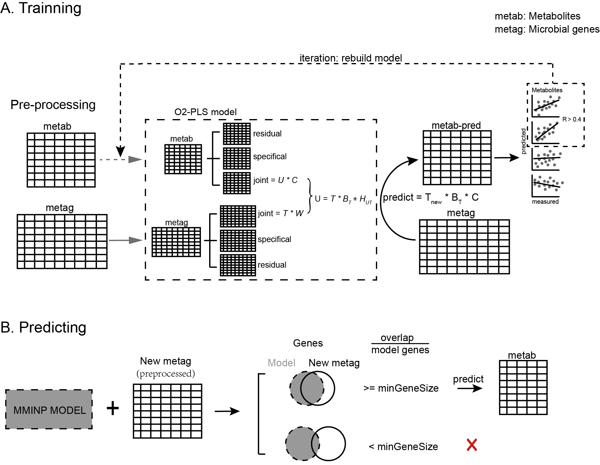

```{r, include = FALSE}
knitr::opts_chunk$set(
  collapse = TRUE,
  comment = "#>"
)
```

## Introduction

MMINP is a computational framework to predict microbial community-based 
metabolic profiles using microbial genes. The main core is O2-PLS algorithm, which aimed to split structured noise caused by each omics data and discover interactions of the real joint parts between two omics.  

```{r, echo=FALSE, fig.width = 12, dpi=400, fig.align="center", fig.cap= "The Overview of the design of MMINP package"}

```

MMINP is composed of two main functions: `MMINP.train()` and `MMINP.predict()`.  

`MMINP.train()`: creates an 'o2m' model which containing interactions of joint parts between microbial features and metabolites. This function contains three steps. Step1, Build an O2-PLS model and use it to predict metabolites profile; Step2, Compare predicted and measured metabolites abundances, then filter those metabolites which predicted poorly (i.e. metabolites of which correlation coefficient less than `rsignif` or adjusted pvalue greater than `psignif`.); Step3, (iteration) Re-build O2-PLS model until all reserved metabolites are well-fitted.

`MMINP.predict()`: takes a model trained by MMINP.train() and a table of microbial feature (i.e. microbial genes) abundance as input, output a predicted metabolite abundances table. When sufficiently accurate, these predicted metabolite relative abundances may be used for downstream statistical analysis and biomarker discovery. 

Note that the abundances of both microbial features and metabolites are expected to be preprocessed by `MMINP.preprocess()` before modelling and prediction.

## Installation

Get the released version from CRAN:  

```{r eval = FALSE}
install.packages("MMINP")
```

Get the development version from github:

```{r eval = FALSE}
if (!requireNamespace("remotes", quietly=TRUE))
    install.packages("remotes")
remotes::install_github("YuLab-SMU/MMINP")
```

## Usage
### Trainning

```{r warning=FALSE, message=FALSE}
library(MMINP)
data(train_metag)
data(train_metab)
train_metag_preprocessed <- MMINP.preprocess(train_metag, normalized = FALSE)
train_metab_preprocessed <- MMINP.preprocess(train_metab, normalized = FALSE)
  
model1 <- MMINP.train(metag = train_metag_preprocessed,
                      metab = train_metab_preprocessed,
                      n = 1:10, nx = 0:5, ny = 0:5)
```

### Prediction

```{r warning=FALSE, message=FALSE}
library(MMINP)
data(MMINP_trained_model)
data(test_metag)
test_metag_preprocessed <- MMINP.preprocess(test_metag, normalized = FALSE)
pred_metab <- MMINP.predict(model = MMINP_trained_model$model,
                            newdata = test_metag_preprocessed)
pred_metab[1:10, 1:10]
```

  
